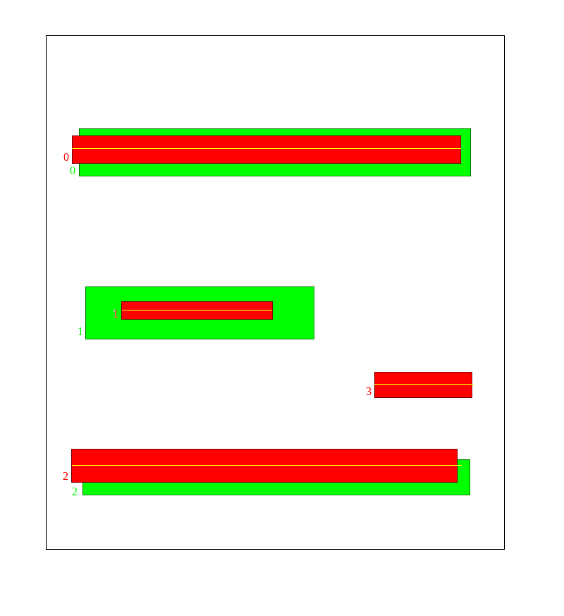
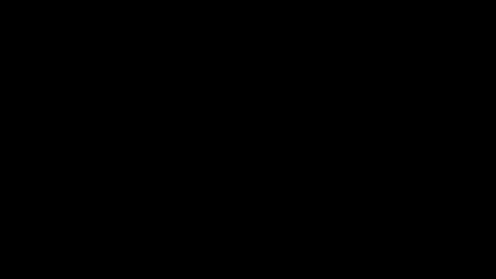

[Home](./index.html) / [Research](./research.html)

# Line Over Ground Truth loss

For the past 6 months, I have worked on shelf detection/enumeration. In our case, the main goal of shelf detection was to determine the ordinal number of the shelf on which the product is placed on (most bottom shelf (first), middle shelf (second), ...). The exact and precise localization of the shelf bounding boxes wasn't necessary. We have tried to apply some traditional computer vision methods to this problem but none of them proved to be robust enough to be used in an "in-the-wild" environment such as a store.


*Image where mAP says these predictions are bad (beacuse of it being based on IoU) but in our specific case of shelf detection/numeration the predicted bounding boxes work just fine.*

## Motivation for this metric

I am proposing a new evaluation metric - LoGT, that represents the predicted bounding box as a line that is going through the middle of that bounding box. For a line that crosses the ground truth bounding box the value of LoGT is 1, otherwise it's 0. Keep in mind this is purely an evaluation metric and training is still done using CIoU (me and my colleague tried to formulate our training loss but cIoU was simply better than anything we came up with :) ). This being a very simple 1-class object detection problem where even the simplest yolo network configuration achieves great results but requires a "large" amount of parameters. Using my previously proposed metric I managed to prune the memory footprint from 1.4M parameters (yolov5n, the smallest config you can find on the ultralytics yolov5 github repo) to a tiny yolov5femto/yolov5pico models of 30k/150k parameters, with the same FPN based architecture but significantly fewer filters in every convolutional layer, achieving nearly the same results on their in-house shelf detection dataset.

[LoGT_matrix source code](https://github.com/jere357/yolov5-RGBD/blob/master/val_jere.py#L526)
I will try to explain this code here 


The general idea behind LoGT as a loss is that if a prediction desrcibed as a line passes through the ground truth bounding box the result is satisfactory. It is designed for problems where exact localization of the object isn't necessary. A potential problem for this metric is data where there is high overlap between bounding boxes; further research required.

## Explanation

I will try my best to explain how i imagined LoGT loss on an example. It is similair to IoU. So far it is only discrete, it could be continuous in the future but I'm not sure how much it matters since i only use it as an evaluation metric. Let's say you have G ground truth bounding boxes and P predictions. We construct a LoGT matrix where each row is a predicted bounding box, and each column is a ground truth bounding box. The matrix shape is PxG. Element (i,j) of that matrix is the LoGT metric between that prediction and the ground truth. 

The First thing to do is deconstruct the prediction bounding boxes into lines, this could be something else but i decided to [KISS](https://en.wikipedia.org/wiki/KISS_principle) (so far, I felt there was no need to complicate things on a simple task such as shelf detection).

```python
P = bboxes_to_lines(predictions) # represent predicted bboxes as a single line going through the middle of that box
LoGT_matrix = zeros(P,G) # [PxG] skeleton
for line in P:
    for ground_truth in G:
        if overlap(line,ground_truth): 
            LoGT[j,i] = 1
        else:
            LoGT[j,i] = 0 # it already is 0 but leaves room for future code when maybe i don't want it to be discrete

```
## Example

Consider an example like this: green are the ground truth bounding boxes, and red are your predicitons. They are indexed with numbers so it's more intuitive to follow the rows and columns.

After the algorithm is run, our LoGT matrix would look like this:

$$
\begin{bmatrix}
1 & 0 & 0\\
0 & 1 & 0\\
0 & 0 & 0\\
0 & 0 & 1\\
0 & 0 & 1
\end{bmatrix}
$$

The above written pseudocode will behave like this


*This gif visually emulates how the algorithm behaves*


Notice that the third row is filled with zeroes, that is the false positive bounding box. Now We need to pad the matrix with null-columns until it is square. in order to lower the score for the false predictions.
```python
if len(P) > len(G):
    LoGT_matrix = concat((LoGT_matrix, torch.zeros((P.shape[0], P.shape[0] - G.shape[0]), dtype=LoGT_matrix.dtype, device=LoGT_matrix.device)), dim=1)
```

#TODO: multiple predictions of the same shelf -> post processing


$$
\begin{bmatrix}
1 & 0 & 0 & 0 & 0\\
0 & 1 & 0 & 0 & 0\\
0 & 0 & 0 & 0 & 0\\
0 & 0 & 1 & 0 & 0\\
0 & 0 & 1 & 0 & 0
\end{bmatrix}
$$

after this our matrix looks like this, in order to calculate the final LoGT score we just sum the columns and voila - we  have our LoGT vector.

$$
\begin{bmatrix}
1 & 1 & 1 & 0 & 0\\
\end{bmatrix}
$$

Final metric calculation is not trivial i guess #TODO, for this example here

$$LoGT= 0.66$$

#TODO: keep developing this as an eval metric with the goal of pruning object detection models which can be quite large


If you have any suggestions or critiques on this work feel free to contact me at jeronim96@gmail.com