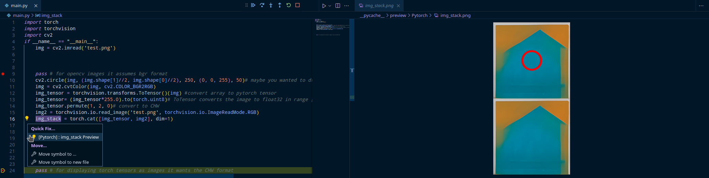
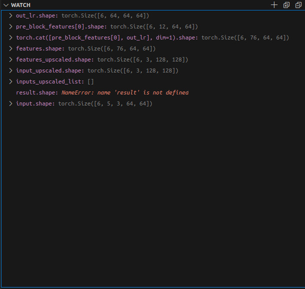

[Home](./index.html) / [Blog](./blog_index.html)

# A cool VSCode extension for computer vision workflows

Basically, this entire blogpost is about a vscode extension for viewing images while in debug mode. I would often find myself drawing things on images and wondering what certain images in variables looked during debugging.

[Python Image Preview](https://marketplace.visualstudio.com/items?itemName=076923.python-image-preview) this extension does exactly what I wanted.
It allows you to view images in vscode while in debug mode. It supports torch tensors, cv2 images and PIL images.

## How it looks like

{:width="80%"}

*This photo shows the extension displaying a cv2 image.*

Then we draw a circle on the cv2 image convert it to a torch.Tensor and stack in on another image

{:width="80%"}

*This photo shows the extension displaying a Tensor image.*

That's it, that's the entire blogpost. I hope you found this useful, and this helps you while working with images.

## Bonus vscode for debugging neural networks

I also like keeping track of tensor shapes while debugging my networks, you can also do that so you know what you're dealing with every line of the code.

I also like this approach when im experimenting with a new architecture, breakpoint every line of code in the forward pass and just track the shapes from one line to another, makes it much easier to understand what's going on, especially when the source code doesn't have tensor shapes as comments :)

{:width="60%"}

[back](./)
